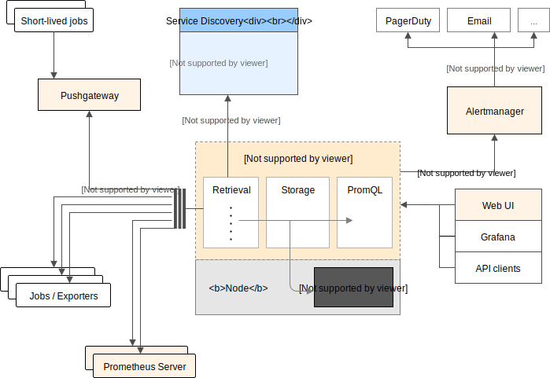

# 201: Introduction to Prometheus

[https://prometheus.io](https://prometheus.io) is an open source time series database that focuses
on capturing measurements and exposing them via an API.

**Key features**

- Very Simple
- Pull data, not push
- No reliance on distributed storage
- No complex scalability problems

---

## Architecture

- **Scrapes** _metrics_ from instrumented applications, either
    - directly, or
    - via in intermediatary push gateway

- **Stores** data

- **Aggregates** data and runs **rules** to generate a new time series or generate an alert

- **API** consumers are used to visualise and act upon this data

---

---

## Where Does it Work Well?

- **Microservices**: It handles multi-dimensional metrics simply and efficiently.

- **Mission Critical**: Its inherent simplicity means it is dependable. When other parts of your
  system are down, Prometheus will still be running.

---

## Where Does it Not (try to) Work Well?

- **Accuracy**: Prometheus scrapes data. If you have services that require accuracy (e.g. per usage
  billing) then Prometheus is not a good fit. Scrapes are not guaranteed to occur.

- **Non HTTP Systems**: There are other encodings, but HTTP is dominant. If you don't use HTTP
  (e.g. grpc) you're going to have to add some code to expose the metrics. (See [go-grpc-prometheus](https://github.com/grpc-ecosystem/go-grpc-prometheus))

---

## Prometheus vs...

You may have some experience with other systems. Let's compare...

---

### ... Graphite

- Just a time series database, not a monitoring solution out of the box.

- Common to only store aggregates, not raw time series.

- Has expectations for time of arrival that doesn't fit well with Microservices.

---

### ... InfluxDB

- Quite similar

- Commercial offering is distributed, which means you have to manage another distributed system.

- Better at event logging

- More complex than Prometheus

---

### ... OpenTSDB

- Hadoop/HBase based, so distributed complexity

- Just a time series database, not a monitoring solution out of the box.

- A possibility if you're already managing Hadoop-based systems

---

### ... Nagios

- No notion of labels or query language

- Host based

- Out of the box monitoring

- Possibly ok (but expensive) form of black-box monitoring. Not really suited towards microservices.

---

### ... NewRelic

- Fought hard to keep up with Microservices

- Complex

- Focused more on the business side

- Probably a better option that Nagios

- Most features can be replicated with open source equivalents

---

### Generally

I think Prometheus' simplicity is key. All the previous examples are seriously complex in comparison.

But it is not business focused. It's developer focused.

---

## Data Model

All of the data is stored as a _time series_. I.e. a measurement with a timestamp.

Measurements are known as _metrics_.

Each time series is uniquely identified by a _metric name_ and a set of _key-value pairs_, a.k.a. _labels_.

---

### How Is the Database Structured?

The _metric name_ is used to denote the feature that is being measured.

E.g. `http_requests_total` - total number of HTTP requests.

Must match the regex: `[a-zA-Z_:][a-zA-Z0-9_:]*`

---

_Labels_ represent multiple dimensions of a _metric_.

A combination of a metric name and a label yields a single metric.

E.g. `http_requests_total{service=orders}` - total number of HTTP requests for the orders (value)
service (key).

Must match the regex: `[a-zA-Z_][a-zA-Z0-9_]*`

---

An observation (they call it a sample!) is a combination of a `float64` value and a millisecond
precision timestamp.

Prometheus does not store strings! It is not for logging!

---

Given a metric name and key-value labels, the following format is used to address metrics:

    <metric name>{<label name>=<label value>, ...}

---

## Types of Metrics

Prometheus caters for different types of measurements by having four different types of metrics.

All types are eventually flattened to untyped time series.

---

### Counter

A cumulative metric that only ever increases.

For example:

- Requests served
- Tasks completed
- Errors occured

Should not be used for metrics that can also go down. (e.g. number of threads)

---

### Gauge

A metric that can arbitraily go up and down.

E.g.

- Temperature
- Memory usage
- Live number of users

---

### Histogram

Places an observation into configurable buckets.

E.g.

- Request duration
- Response size

A histogram will create several metrics and has some special helper functions (which we will see later)

- cumulative counters for the observation buckets, `<basename>_bucket{le="<upper inclusive bound>"}`
- the total sum of all observed values, `<basename>_sum`
- the count of events that have been observed, `<basename>_count` (identical to
  <basename>_bucket{le="+Inf"} above)

---

### Summary

Basically a pre-configured Histogram. You select the quantiles and aggregation in advance to reduce
the server-side calculation burden.

Recommendations:

- Generally don't use this. Use a histogram
- Only use for static, well defined metrics
- Consider its use when performance is a concern

---

## How Does Prometheus Obtain Metrics?

One of the key's to Prometheus' simplicity.

Many other monitoring solutions expect to be handed data. (Push model)

Prometheus reaches out to services and scrapes data itself. (Pull model)

---

### Push vs. Pull Models

Pull Advantages:

- Easy to tell if target is down
- Manually inspect health via a web browser
- Ease of development (just point your laptop at the service)
- Very little load on services
- Services aren't affected by load on the monitoring system

Push Advantages:

- Possibly More secure
- Store events
- Accuracy
- May work in firewalled setups

---

### FAQ 1: Pull Doesn't Scale!

- Nagios uses a pull model, but it uses complex scripts to fetch data and assert state. Because it
  was so slow, people had to use update rates of 1 per 5 minutes, or so.

- Prometheus uses HTTP and only HTTP. It spins up HTTP connections like lightning, thanks to Go's
  GoRoutines. The bottleneck is the size of the monitoring data and writing that to disk. Not the connections.

- Proven performance: Given a 10-seconds scrape interval and 700 time series per host, this allows
  you to monitor over 10,000 machines from a single Prometheus server.

- Simple sharding mechanism allows you to scale past a single server.

---

## Using Metrics

Prometheus is permissive; you can use any metrics or names that you want.

But it is important to think about why you are creating a metric and what is the goal of using a
metric.

---

### Instances and Jobs

An individual scrape is called an _instance_.

A collection of replicas of that instance are called a _job_.

E.g.

- job: frontend
  - instance 1: frontend-1:8080
  - instance 2: frontend-2
  - instance 3: 5.6.7.8:5670
  - instance 4: 5.6.7.8:5671

---

### How are names generated?

When Prometheus scrapes an instance, it automatically adds certain labels to the scraped time
series:

- `job`: The job name that the target belongs to
- `instance`: The `host:port` combination of the target's url that was scraped.

_These can be overwritten by including them in the `/metrics` and altering the `honor_labels`
configuration option._

---

Each scrape also produces metrics about the scrape:

* `up{job="<job-name>", instance="<instance-id>"}`: `1` if the instance is healthy, i.e. reachable, or `0` if the scrape failed.
* `scrape_duration_seconds{job="<job-name>", instance="<instance-id>"}`: duration of the scrape.
* `scrape_samples_post_metric_relabeling{job="<job-name>", instance="<instance-id>"}`: the number of samples remaining after metric relabeling was applied.
* `scrape_samples_scraped{job="<job-name>", instance="<instance-id>"}`: the number of samples the target exposed.

The `up` time series is particularly useful for availability monitoring.

---

For all other metrics, **you** decide the metric name and labels.

---

## How To Pick Names

Organisations should generate a naming convention so that:

- You know what to call your metrics during development
- Users can understand what your metric means with just a glance

Labels should be chosen so that they differentiate the context of the metric.

**Everyone should use the same convention.**

---

### Metric Name Best Practices

The following is a list of best practices. Following these rules should help you avoid common
pitfalls ([read more](https://prometheus.io/docs/practices/naming/)).

---

#### Consistent Domain-based Prefixes

A prefix is the first word in a metric name. Often called a `namespace` by client libraries.

Choose a prefix that defines the **domain** of the measurement.

Examples:

- HTTP related metrics should all have a prefix of **http**: `http_request_duration_seconds`

- Application specific metrics should refer to a domain: `users_total`

- Process level metrics are exported by many libraries by default: `process_cpu_seconds_total`

---

#### Consistent Units

Use SI (International System of Units) units.

E.g.

- Seconds
- Bytes
- Metres

Not milliseconds, megabytes, kilometres, etc.

---

#### A Single Unit Per Metric

Do not mix metrics. E.g.:

- One instance that reports seconds with another reporting hours
- Aggregate metrics. E.g. bytes/second. Use two metrics instead.

---

#### Suffix Should Describe the Unit

In plural form.

Examples:

- `http_request_duration_seconds`
- `node_memory_usage_bytes`
- `http_requests_total` (for a unit-less accumulating count)
- `process_cpu_seconds_total` (for an accumulating count with unit)

---

#### Mean the Same Thing

The metric name should mean the same thing across all label dimensions.

E.g.

The metric `http_requests_total` means the same thing, despite having different labels as below:

- `http_requests_total{status=404}`
- `http_requests_total{status=200}`
- `http_requests_total{status=200, path="/users/"}`

---

#### Testing That Names Make Sense

One tip provided by the authors is very useful:

> either the sum or average over all dimensions should be meaningful (though not necessarily useful)

E.g.

- the capacity of various queues in one metric is good, while mixing the capacity of a queue with
  the current number of elements in the queue is not.

Generally, split metrics into single unit types.

---

### Label Best Practices

- Used to differentiate context

`api_http_requests_total` - differentiate request types: type="create|update|delete"
`api_request_duration_seconds` - differentiate request stages: stage="extract|transform|load"

Do not put context in metric names as it will cause confusion.

Also, when we perform aggregations, it's really nice to see the aggregations for different contexts.

E.g. does one stage take significantly longer than the others?

---

### 1 Label === 1 Dimension

Each new key-value pair represents a new dimension.

If you pick a key that has many values, this dramatically increases the amount of data that must be
stored.

For example, **DO NOT STORE**:

- ID's
- Email addresses
- Timestamps of any kind
- Anything unbounded

Generally, **All key values must be a bounded set**.

---

No workshop here. Next we'll look at spinning up Prometheus.

Probably time for a break. :-)

---
