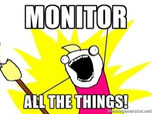

# 203: Monitoring Theory

After the practical excitement of using Prometheus, let's go back to the theory.

- What do we mean by monitoring?
- Why do we need it?
- What are our goals of monitoring?
- What happens, really?

---

## Logging vs. Tracing vs. Instrumentation

These are completely different, and serve different purposes.

More information:

- [Logging V Instrumentation - Peter Bourgon](https://peter.bourgon.org/blog/2016/02/07/logging-v-instrumentation.html)
- [Monitoring Performance in Microservice Architectures - Lukasz Guminski](http://container-solutions.com/monitoring-performance-microservice-architectures/)
---

### Logging

- Applications produce logs. Logs represent state transformations within an application.

- Obtaining, transferring, storing and parsing logs is expensive.

- Log only what is necessary to act upon. Log only actionable information.

- This means: panic-level information for humans, structured data for machines (Question whether
this is really necessary).

---

### Instrumentation (a.k.a. Monitoring)

- Instrumentation represents the use of an application of system. It is used for diagnostic purposes.

- Instrumentation is cheap and structured. (We've seen prometheus is simply a set of key-value pairs)

- The more data you have, the more useful it becomes.

- Hence, instrument everything that is meaningful in the domain of your application.

---

### Tracing

- A trace represents a single user's journey and use of the system as a whole. Similar to logging,
  but different requirements.

- Often used for performance optimisation.

- Only makes sense when systems become complex enough

- Add significant complexity to both code and architecture

- Same performance concerns as logging; it's expensive.

---

So, Monitoring != Logging != Tracing.

---

## Site Reliability Engineering

- Championed by Google.

- Essentially a specific implementation of DevOps.

More information:

- [Google's SRE Book - Free](https://landing.google.com/sre/book/)

---

### Responsibilities

A Site Reliability Engineer is responsible for:

- availability
- latency
- performance
- efficiency
- change management
- monitoring
- emergency response
- capacity planning

Very similar to a traditional SysAdmin.

---

### Key Differences

- SRE's are software engineers.

- When combining with DevOps, SREs _are_ the engineers building the platform.

- Focused towards service availability as opposed to feature set or performance

- Hence, significant efforts are spent automating and implementing monitoring solutions.

---

## Risk

- Quantify risk: how important is a service to a business?
  - What is expected?
  - Is availability tied to revenue?
  - Is it a free service?
  - Competitive advantage?
  - Consumers or Enterprise?
- Quantify performance:
  - Similar to above.

Ideally, Engineers want to be given clear objectives to which their service must meet. These are
called _service metrics_...

---

## Service Metrics

Service Metrics can be split up into:

- Service Level Objectives (SLO)
- Service Level Indicators (SLI)

These then go on to create a _Service Level Agreement_ (SLA) which externally defines the
availability and performance of your system to your customers.

---

### Service Level Objectives

Represent material impacts to the business.

Might include:
- Performance metrics, e.g. less than 100ms latency
- Availability metrics, e.g. available for 99.9% of the time (three nines)
- Durability, e.g. data is stored for one year with 99.999% availability)

Google Compute Engine's SLA states 99.95% availability.

Key takeaway: defined SLO's state that downtime is ok.

99.9% availability equates to this amount of downtime:
* **Daily:** 1m 26.4s
* **Weekly:** 10m 4.8s
* **Monthly:** 43m 49.7s
* **Yearly:** 8h 45m 57.0s

---

### Aside: Don't be Too Good

When services approach 99.9%+ levels of uptime, users often assume services will always work.

Google talks about one of their internal tools called Chubby, which is a distributed lock. People
started using it as a dependency, because it never went down.

Now, Google sticks to their SLO budgets and intentionally kills the service to weed out any services
that have accidentally used it as a dependency!

---

### Service Level Indicators

- Sometimes there are indicators that directly measure an SLO.

For example, we can measure availability directly.

- Other times, we have to use a proxy that approximately equates to a SLO.

For example, we can time requests, but that doesn't take latency between the user and the server
into account.

**Make sure you have indicators for all of your SLOs**

---

## Toil

Toil is the term given to "doing work that people don't want to do".

For example, being on call or dealing with an incident.

People don't want to do that, so it is worth investing time into automating these tasks or
preventing them from happening. Toil adds stress, lowers morale, slows progress, promotes attrition.

If possible, toil should be measured quantitatively so that engineering effort can be optimised.

---

## What is Normal?

> If a human operator needs to touch your system during normal operations, you have a bug. The definition of normal changes as your systems grow.

Carla Geisser, Google SRE

But what is normal?

Largely a philosophical debate. But must include what is expected of your system.

Normal is: "usual, typical, or expected" - OED.

---

## What Should we Monitor?

The question of _what_ to monitor is a good one. But it depends on context.

From a development perspective, more is better. It is very easy to filter/aggregate out any unnecessary metrics.

However, from an operational standpoint **be careful not to burden users with too much information**.

---

### Microservice Level Indicators

Service Level Indicators are of primary concern. These should be displayed front-and-centre.

But Microservice Level Indicators ensure that your microservice is operating normally.

Generally, metrics fall into two groups:

- Service usage

- Resource usage

---

#### Resource Usage

Simple. Just monitor the resource usage of your services.

Ensure that services don't unexpectedly use more resources. E.g. Memory leak.

---

#### Service Usage

Several different rules of thumb.

RED Metrics:

- Request **R**ate: The number of requests per second
- Request **E**rrors: Number of failed requests per second
- Request **D**uration: Distribution of the amount of time requests take

[The RED Method: key metrics for microservices architecture](https://www.weave.works/blog/the-red-method-key-metrics-for-microservices-architecture/)

Which is a simplification of the _Four Golden Rules_...

---

#### Four Golden Rules

- Latency: Important to measure latency of 200 and 400/500 errors separately.
- Traffic: Measure of demand placed on a system
- Errors: Rate at which requests fail
- Saturation: How "full" the service is (e.g. memory/cpu saturation, does the service degrade before saturation?)

[Google SRE Book](https://landing.google.com/sre/book/chapters/monitoring-distributed-systems.html)

---

#### Use Method

- Resources: Cpu/Ram/etc.
- Utilisation: Average time that the resources was busy
- Saturation: The degree to which the resource has extra work, which it can't service
- Errors: Number of errors

[The USE method](http://www.brendangregg.com/usemethod.html)

Personally I think this mixes the resource monitoring and service monitoring. I think they should be separate monitoring tasks.

---

## Being On-Call

Being on call during an emergency is very stressful and hard work (much like training!).

But it is necessary to ensure a service runs smoothly.

To prevent burnout/attrition/loss of moral, on call incidents should be limited. Google suggests no
more than 25% of an Employee's time.

---

### Alert Fatigue

The [Broken Windows theory](https://en.wikipedia.org/wiki/Broken_windows_theory): maintaining and
monitoring neighbourhoods for petty crimes helps prevent more serious crimes from occurring.

In a sea of alerts, it's impossible to see those that will breach the SLO.

Low priority alerts that frequently bother the on-call Engineer disrupts productivity and introduces fatigue.

Serious alerts can be treated with less attention than necessary.

Reduce the number of alerts for a single incident. There's no need to swamp a system with many
alerts for the same underlying cause.

---

### Emergency Response

Your systems will break. What do you do? Follow a procedure.

- Don't Panic!

- Observe: Find and use the monitoring and logging systems

- Orient: Establish what has gone wrong

- Decide: Plan a course of action

- Act: Enact the plan

- Review: Record what happened for posterity. Learn from mistakes.

More information:

- [OODA loop](https://en.wikipedia.org/wiki/OODA_loop)

---

#### Keep Your Users Informed

Users are not stupid.

They will resort to twitter to complain that a service is down.

It is always better to be open and honest about availability.

Always keep them in the loop.

---

### Incident Management

- **Prepare**: Develop incident management procedures in advance

- **Prioritise**: "Stop the bleeding", restore the service and preserve the evidence

- **Trust**: Give full autonomy to all participants

- **Introspect**: If you start feeling stressed or panicky, ask for help

- **Consider Alternatives**: When stressed, the instinctive decision might not be the best

---

### Postmortems

After an incident, hold a postmortem to review the incident.

- Keep a live document to collaborate and add information

Key tasks of a postmortem:

- Was key data collected for posterity?
- Are impact assessments complete?
- Was the root cause established?
- Is the action plan appropriate?
- Are fixes at an appropriate priority?
- Has the outcome been shared with stakeholders?

---

## Chaos Engineering

A developing discipline where systems are intentionally harmed to simulate failure.

- Practice incident failure

- Test system's resiliency

- Identify weaknesses (e.g. improper timeouts, retry storms, cascading failures, etc.)

- Builds confidence in a system

---

## The Future

- Stateful vs. Semantic monitoring

We're currently monitoring the state of a system. Semantic monitoring is about modelling a system
and alerting when the model deviates from the norm.

E.g. We don't monitor the health of cells in the heart to see if the heart is healthy. Instead, we
listen to the electrical impulses that a heart makes when it beats. If the resultant signal is not
normal, we can say that the heart is not healthy.

[More info](http://container-solutions.com/monitoring-performance-microservice-architectures/)

- Automation

Data Science will creep into monitoring systems. It already has at a low level, but common tasks
like anomaly detection will increasingly be perform automatically. Marketing likes to call this AI.
:-/

[More info](https://trainingdatascience.com)

---
