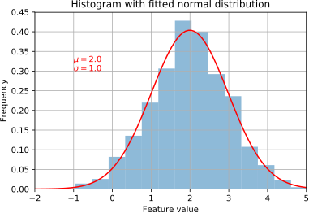
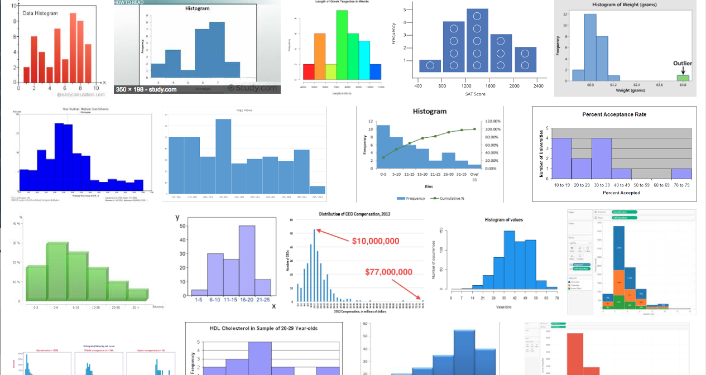
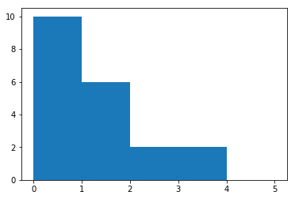

# 302: Data Science

What is data science? Data Science is a combination of:

- Statistics
- Software Engineering
- Analysis
- Research

Sub-disciplines include:

- Machine Learning
- Big Data
- Analytics
- So called A.I.
- etc.

[Find out more](https://winderresearch.com/what-is-data-science/?utm_source=training&utm_medium=offline&utm_content=link)

---

### What's Data Science got to do with Monitoring?

Good question.

Think about what we're doing. We're creating metrics. These metrics are time series.

We are working with data. We need to understand a little about the Science so we can make better use
of the data.

This section introduces Data Science, in relation to monitoring.

---

## Statistics

Statistics is a mathematical discipline that helps us describe _non-stationary_ data.

Non-stationary means that if we were to measure the same thing twice, we wouldn't get the same
result each and every time.

Statistics is all based around the idea of _probability_. This is the chance of an event occurring.

E.g. We use probability in our language all of the time without noticing it.

- I'm never going to win the lottery => a low probability
- It's probably going to be sunny in Spain tomorrow => a high probability.
- What are the chances of that! England won the World Cup! => A very low probability.

---

### Probability

One way of defining probability is on a scale of 0 to 1. 0 means it will never happen, 1 means it
will always happen.

Nearly everything you can ever think of is greater than 0 probability and less than 1.

---

#### How can we use Probability?

Thinking probabilistically allows us to quantify how probable an event is.

"What are the chances that production is going to go down whilst I'm on call?"

"Given this strange data, what is the probability that this is going to affect production?"

But first, we need to understand what "random" looks like...

---

### What is Random?

A random, or stochastic event is one that can only ever be represented by a range of values. There
is no exact answer.

A large proportion of all data falls into this category. Even think that you think of as stationary.

For example, how much money do you have in your bank account?

- Really?
- Are you sure?
- What's that? The Bank uses atomic locks on their Microsoft SQL server so it's perfectly safe?
- Oh no. The value of your currency has just changed and now you can't buy as much as you could before.

Even the value of cold hard cash is a random variable. It is not stationary.

---

#### Probability Distributions

Random variables can be described in a number of ways. Most often they are described by a _summary
statistic_.

That is a set of numbers that summaries the tendency of the data.

But a random variable varies according to how probable each value is, not how the summary statistic
states it should.

The probability of each value is called the _probability distribution_. A distribution of
probabilities for each value.

Another way is to present the spread of the data visually, in something called a _histogram_.

(Have you seen that word before?!)

---

#### Histograms

Histograms are counts of the number of times an _observation_ falls into a _bin_.



---

#### Different Types of Histograms

When viewing the data like this, you can see a whole range of distributions.


---

#### Yeah, So What?

Wait, we'll get there. :-)

---

#### A Quick Note on Terminology

- **Observation** - A single measurement
- **Population** - All possible measurements that could ever be made
- **Sample** - A subset of the population. Ideally a _representative_ subset.

---

## Modelling

Modelling is the task of summarising a non-stationary metric as a simpler set of summary statistics.

You've probably used one model a lot, the _mean_.

The mean is a measure of the central tendency of a Normal distribution.

The _Standard Deviation_ is the amount of spread around that central tendency.

[Learn more about why we use standard deviation as a measure of spread here](https://trainingdatascience.com/tips/why-do-we-use-standard-deviation/?utm_source=training&utm_medium=offline&utm_content=link)

Let's look at that plot again:

---


---

### Yeah, So What? (Part Duex)

The issue is that data never looks like that histogram.



---

### What Does that Mean? Get to the Point!

Remember what we said earlier?

The _Mean_ and _Standard Deviation_ are summary statistics for a **Normal Distribution**.

And **ONLY** a Normal Distribution.

Because our data is hardly ever normal (especially when working with monitoring data) the mean
mis-represents the **most likely value** and the **most likely spread** of that value.

So, if you take one thing away from today, I want it to be this.

### Don't use the mean!

---

Let's take a quick example. Imagine you had a set of HTTP request durations.



```python
bad = [0,1,0,0,0,0,1,1,0,0,1,2,0,3,1,3,0,2,0,1]
print("\mu =", np.mean(bad), ", \sigma =", np.std(bad))
```
```text
\mu = 0.8 , \sigma = 0.979795897113
```

---

### The Median

So what do we do instead?

We use the **median**.

The median is the value that separates splits the probabillity distribution in half.

In other words, if we ordered all the values, the median is the one in the middle.

The key is that the median is not skewed as much by the mean and quite often (not always) represents
the most common value.

---

#### Percentile

The median is just a special case of a percentile, the 50th percentile.

This is stating that 50% of the data is lower than this value.

We can also use the 99th percentile, to state that 99% of the values are lower than this value.

Full circle:

We use percentiles to represent HTTP durations because

a) the mean isn't accurate and

b) it's easy to create SLO's that correspond to "most of our users have this level of service".

---

## Anomaly Detection

A large subject, but here's a quick primer.

Anomaly detection is detecting when things are not "normal". It comes down to two key steps:

1. Define a model
2. Alert when values deviate from that model

---

### Creating an Anomaly Detector

To create an anomaly detector we need a model.

Thankfully you now know all about models! ;-)

Now you just need an alert that tells you that you are deviating from that model.

Most often this is something you can do manually.

- You know how systems should be operating.
- Sometimes you have SLIs that you have to meet.
- So simply set the "threshold" at that level.

---

### Creating a More Advanced Anomaly Detector

The next level of sophistication is setting a baseline, which is the basis of your model.

Then you set your threshold at something higher than your baseline.

This works really well when you have metrics that change over time.

For example,

- maybe load is greater during the day.
- So you'd have to set the thresold higher than the daytime use.
- But that is way higher than it needs to be at night.

So we could have a trailing median, and set a threshold twice as high as that baseline. This way,
the threshold will change over time.

Anything more than this and we're coming dangerously close to doing a proper Data Science course!

---

## More Information

- Free and commercial training:
  [https://TrainingDataScience.com](https://trainingdatascience.com/?utm_source=training&utm_medium=offline&utm_content=link)

Talk to Dr. Phil Winder, an expert in Data Science:
[https://WinderResearch.com](https://winderresearch.com/?utm_source=training&utm_medium=offline&utm_content=link).

---

## Hands On

---
