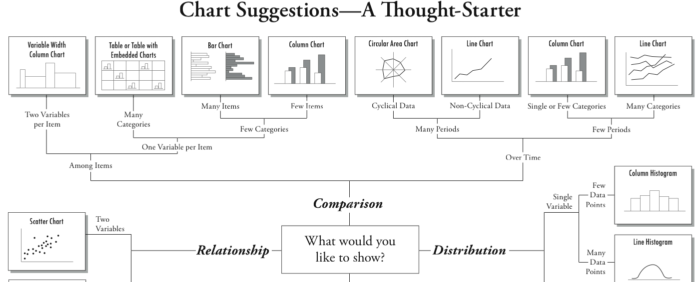
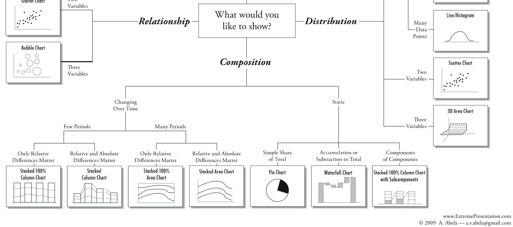
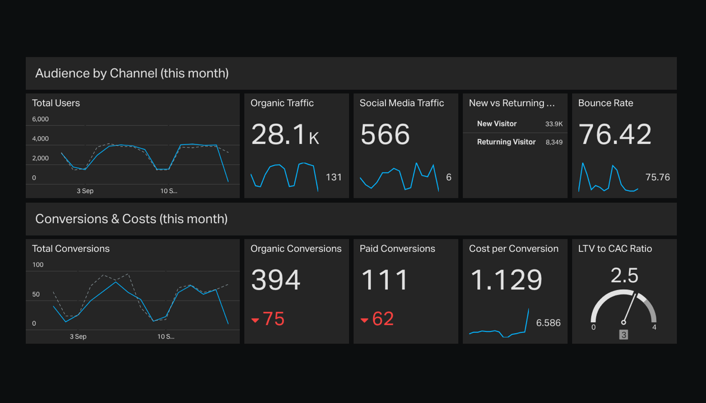
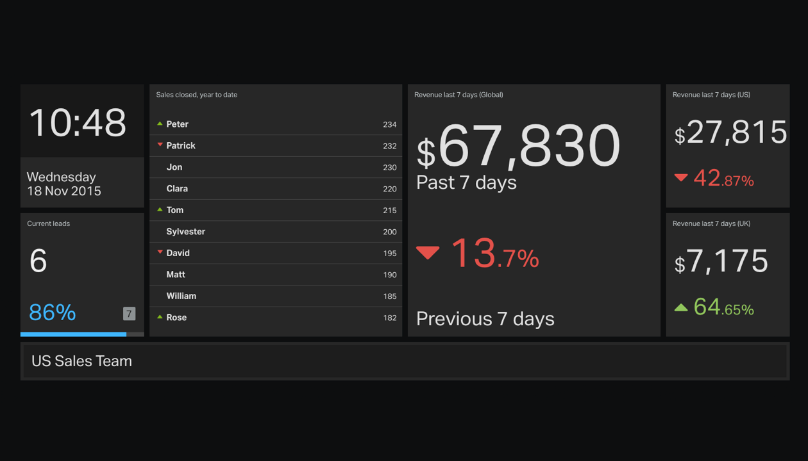
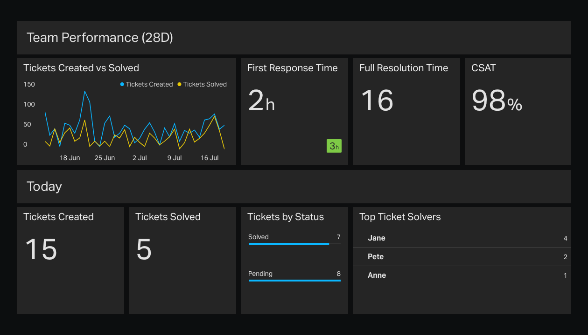
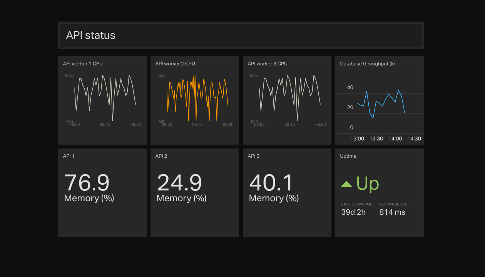
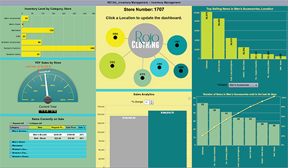
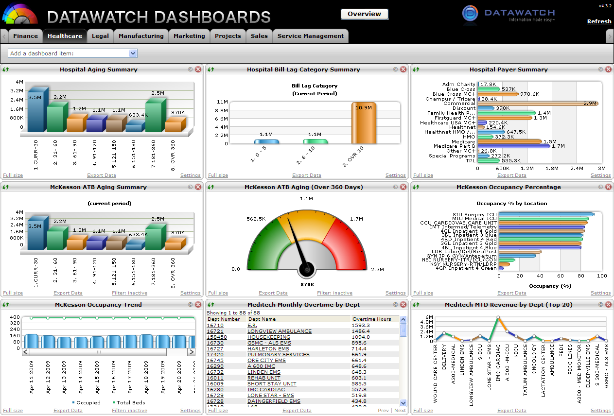
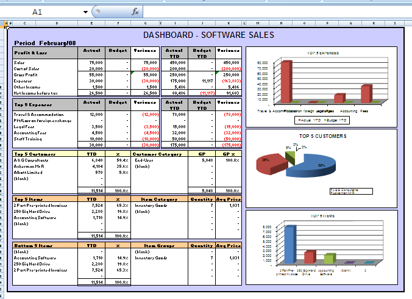

# 403: How to Build a Dashboard

In the previous chapters, we've learnt how to use Grafana and Templating to build dashboards.

We could go away now and build any dashboard we like.

But what makes a good dashboard? Let's find out.

---

## What Makes a Good Dashboard?

- Simple

- Expresses meaning

- Reveals details as required

- Relevance

---

## Information Overload

We have limited cognitive processing capacity. [1]

We can only process one (maybe a few) thing at a time. [2]

Context switching expends mental energy. [3]

- [1] Speier, Cheri; Valacich, Joseph; Vessey, Iris (1999). "The Influence of Task Interruption on Individual Decision Making: An Information Overload Perspective". *Decision Sciences* . **30** . [doi](https://en.wikipedia.org/wiki/Digital_object_identifier "Digital object identifier"):[10.1111/j.1540-5915.1999.tb01613.x](https://doi.org/10.1111%2Fj.1540-5915.1999.tb01613.x)
- [2] [https://en.wikipedia.org/wiki/Human_multitasking](https://en.wikipedia.org/wiki/Human_multitasking)
- [3] Levitin, Daniel J. 2014. *The organized mind: thinking straight in the age of information overload* .

---

### The Antidote: Minimalism

- Your dashboard should provide relevant information in less than **5 seconds** (5-second rule) [1]

- Severely restrict what is included. (E.g. a car dashboard) [2]

- No more than 5-9 Visualisations [1]

- Do not add a graph or text simply because you can [3]

- [1] [Dashboard Design Best Practices – 4 Key Principles](https://www.sisense.com/blog/4-design-principles-creating-better-dashboards/)
- [2] [Theory and Practice of Dashboards](https://www.vocalabs.com/newsletter/theory-and-practice-dashboards)
- [3] [Designing and Building Great Dashboards - 6 Golden Rules to Successful Dashboard Design](https://www.geckoboard.com/blog/building-great-dashboards-6-golden-rules-to-successful-dashboard-design/)

---

## Meaning

- **Place the most important information at the top left**

We always start reading at the top left. The most important information should be at the top.

(Think like a journalist. They put the most important content at the top, details at the bottom.)

- **Use styling to convey meaning**

Red means bad. Green means good.

Big and Bold is important.

Grey and small is less important.

Keep colours and styles simple. Too much style can complicate the data.

---

## Details

Always, **minimalism**.

- Use plots and graphics to reduce the number of dimensions in the data.

- Always focus on the **SLI**'s/**KPI**'s.

- Select the right plot for the data...

---

### How to Choose the Best Visualisation

- Comparison
  - Among Items
      - Column
      - Table with embedded plots
  - Over Time
      - Line/Column
- Distribution
  - 1D: Histogram
  - 2D: Scatter

---

- Composition
  - Over Time
      - Stacked column/area plot
  - Static
      - Pie chart
      - Waterfall
- Relationship
  - Scatter plot

---

https://extremepresentation.com/tools/

---

https://extremepresentation.com/tools/

---

## Relevance: Who Is This Dashboard For?

Your software has a use case. Your dashboards need one too!

- Design dashboards to a **use case**

Think about the audience. Do they understand the metrics you are presenting? Does it need to be
simplified?

You should not have to explain your dashboard.

- Dashboards are **specific** to an audience. Make sure you know who the audience is.

Lets look at some examples...

_Examples from [geckoboard](https://www.geckoboard.com/learn/dashboard-examples/)_

---

### Marketing

---

### Sales

---

### Support

---

### DevOps

---

## Bad Dashboards

Let's look at some bad dashboards...

---

### Colours!

---

### TMI

---

### Excel, really? Key info at right bottom.

---

## Summary

- Keep it Simple

- Expresses meaning: Important at the top. Colours.

- Details: Remember the SLI's. Pick the right plot.

- Focus each dashboard on a use case and audience.

---
